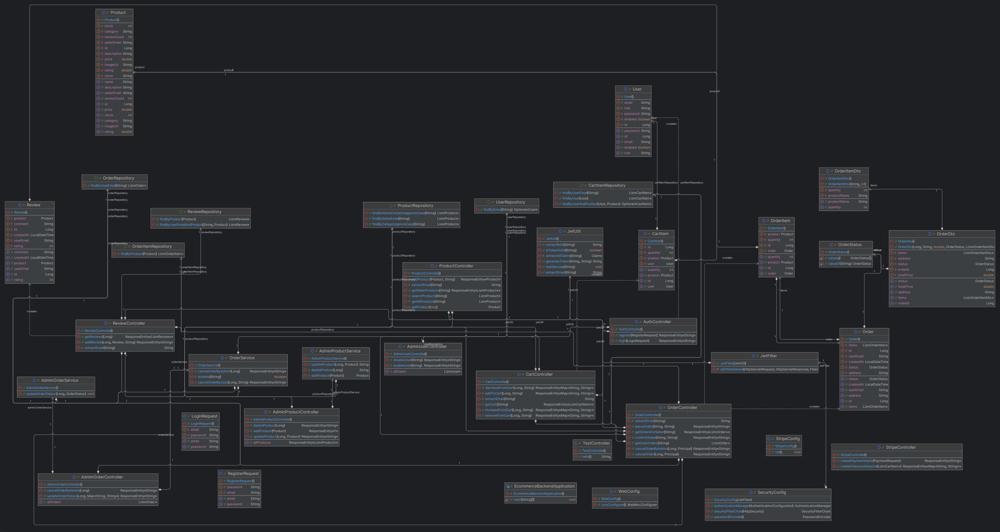
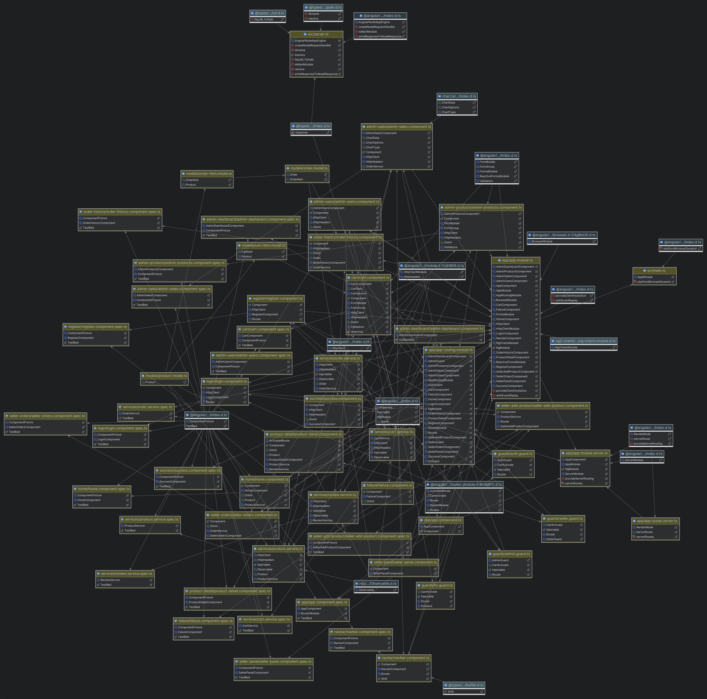
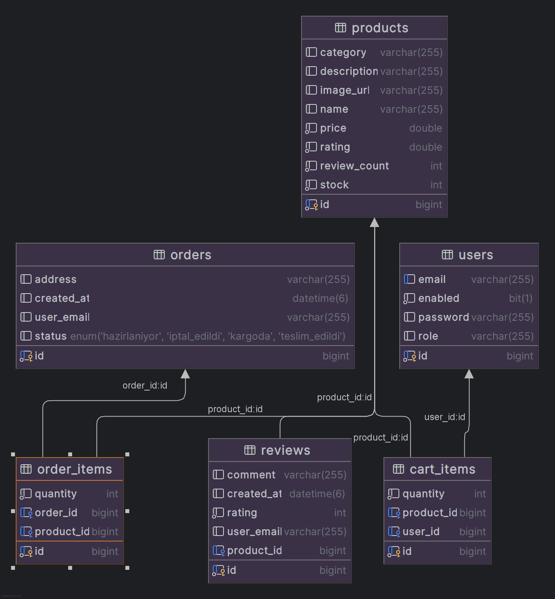

# E-Commerce Web Application

This project is a full-stack e-commerce web application developed as part of the **CSE 214 Advanced Application Development** course. The application consists of an Angular frontend, a Spring Boot backend, and a MySQL database.

---

## 📌 Technologies Used

- **Frontend**: Angular 19, TypeScript, HTML, CSS
- **Backend**: Spring Boot 3, Java 17, Spring Security, JWT, Stripe API
- **Database**: MySQL
- **Authentication**: JSON Web Token (JWT)
- **Version Control**: Git & GitHub

---

## 🎯 Key Features

### 🛍️ User Features
- Register and log in
- Browse and search for products
- Add products to cart
- Checkout with delivery address
- Stripe test payment integration
- Order tracking and order history
- Leave product reviews and ratings

### 🛠️ Admin Features
- Admin dashboard
- Add/edit/delete products
- View/manage users
- Manage orders and update statuses

### 🧑‍💼 Seller Features
- Add/manage own products
- View orders for their own products

---

## 🧠 Architecture Overview

```
Angular Frontend
   ↕️  REST API
Spring Boot Backend
   ↕️
MySQL Database
```

---

## 📁 Project Structure

```
e-commerce-project-final_version/
├── backend/         # Spring Boot application
├── frontend/        # Angular application
├── diagrams/        # Contains architectural diagrams
└── README.md
```

---

## 🖼️ Diagrams

### 1. ✅ Backend UML Diagram


This diagram illustrates the main classes, repositories, services, and controllers in the Spring Boot backend. It shows the flow of entities such as `User`, `Product`, `Order`, and `Review`, and their relations through repositories and services.

---

### 2. ✅ Frontend Dependency Diagram (Angular)


This diagram visualizes the structure of the Angular application, showing the relationships between components, services, and modules. It reflects a modular and well-organized approach.

---

### 3. ✅ Database ER Diagram


This diagram depicts the relational structure of the MySQL database used in the application. Key tables include:
- `users`
- `products`
- `orders`
- `order_items`
- `cart_items`
- `reviews`

---

## ⚙️ Setup Instructions

### 🔧 Backend (Spring Boot)
```bash
cd backend
./mvnw spring-boot:run
```

Make sure you have MySQL running and application properties configured properly.

### 💻 Frontend (Angular)
```bash
cd frontend
npm install
ng serve
```

---

## 🔗 GitHub Repository

Project Repository:  
[https://github.com/cemerdemir-0/e-commerce-project-final_version](https://github.com/cemerdemir-0/e-commerce-project-final_version)

Make sure the repository is public for grading.

---

## 📌 Notes

- All diagrams are placed under the `/diagrams` directory.
- JWT token is stored in `localStorage` after authentication.
- Stripe test cards are available at [https://stripe.com/docs/testing](https://stripe.com/docs/testing)

---
"# e-commerceproject" 
